<div align="center">

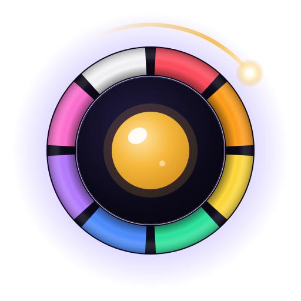

# Rockketeyes

### Say the color, not the word.

A premium, voice-controlled **Stroop test** game for the web and Android.<br/>
Name the ink color out loud, beat the clock, and climb the **Global Legends**.

<br/>

[](https://rockketeyes.web.app)
&nbsp;
[](#-android)


<br/>

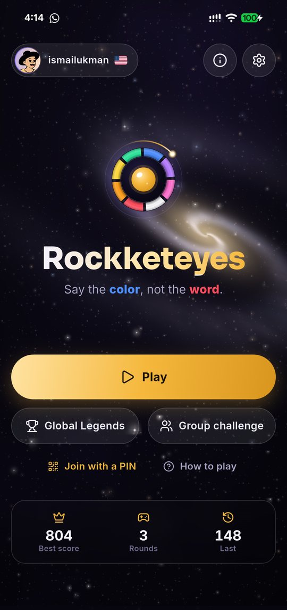
&nbsp;&nbsp;
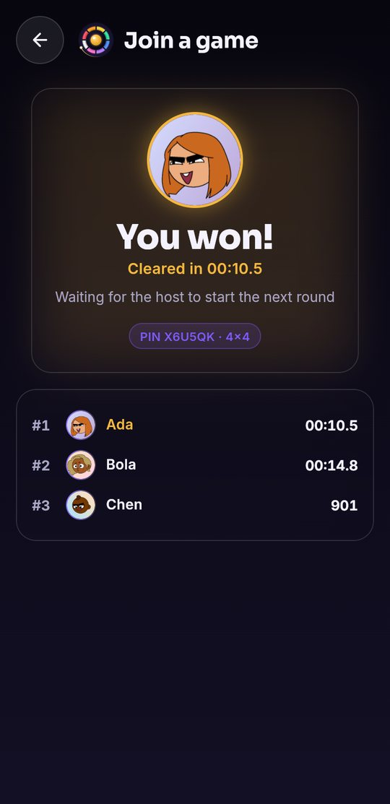

</div>

---

## Why Rockketeyes

Every word on the board is printed in a *different* ink color. Your brain wants to read the word, and your job is to say the **ink**. That split-second conflict, first described by J. R. Stroop in 1935, is one of the most studied effects in cognitive science. Rockketeyes turns it into a fast, beautiful game that trains:

| | |
|---|---|
| **Selective attention** | focus on the ink, ignore the word |
| **Inhibitory control** | stop the automatic response before it happens |
| **Processing speed** | react quickly without slipping |
| **Visual scanning** | move your eyes smoothly across boards up to 16 × 16 |

> Rockketeyes is a game for entertainment and everyday brain training. It is not a medical device.

## ✦ Highlights

- 🎙️ **Hands-free voice play.** A 3-2-1 countdown, then the mic listens continuously. Each color you say moves the gold highlight to the next word.
- ⚡ **Sudden death.** Say the wrong color, or read the word, and the round ends with a clear explanation of what happened.
- 🧩 **Boards from 3 × 4 to 16 × 16.** Easy, Normal and Hard use 4, 6 or 8 colors, and there's a colorblind-safe set. Custom sizes are practice rounds.
- 🏆 **Global Legends.** Rankings for today, this week and all time, per board, worldwide or by country. Scores are replayed and validated on the server.
- 👥 **Group challenge (Kahoot-style).** A host screen shows a QR code and PIN, players join on their phones, everyone gets the same board, and the first to clear it wins.
- 🎨 **Avatar studio.** 14 illustrated character styles plus about 100 emoji avatars on 12 backgrounds.
- 🔐 **Google account.** Connect to save progress across devices and appear on Global Legends. Past best scores are added automatically.
- 🌌 **A living space journey.** The background flies through a spiral galaxy, a nebula, planet flybys (Earth and Moon, Jupiter, Saturn, Mars) and a black hole, with hyperspace jumps, shooting stars and comets.
- ✨ **Premium feel.** Cosmic glass UI, a GPU shader background, animated logo, haptics, CC0 soundtrack and full accessibility labels.

## ✦ Screenshots

<table>
  <tr>
    <td width="50%">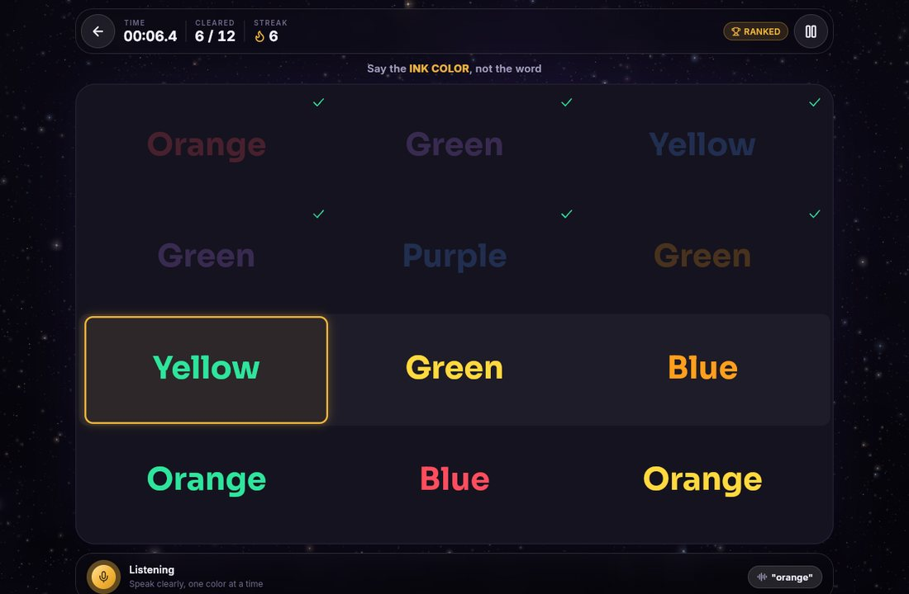<br/><sub><b>Play</b>: the glowing ring follows your voice</sub></td>
    <td width="50%">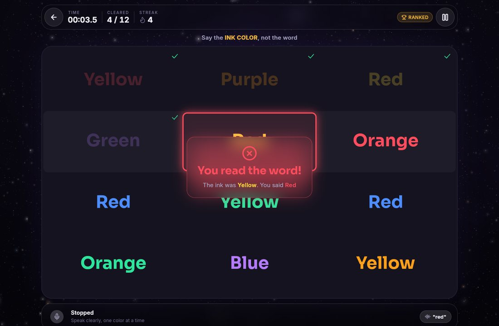<br/><sub><b>Sudden death</b>: every mistake is explained</sub></td>
  </tr>
  <tr>
    <td>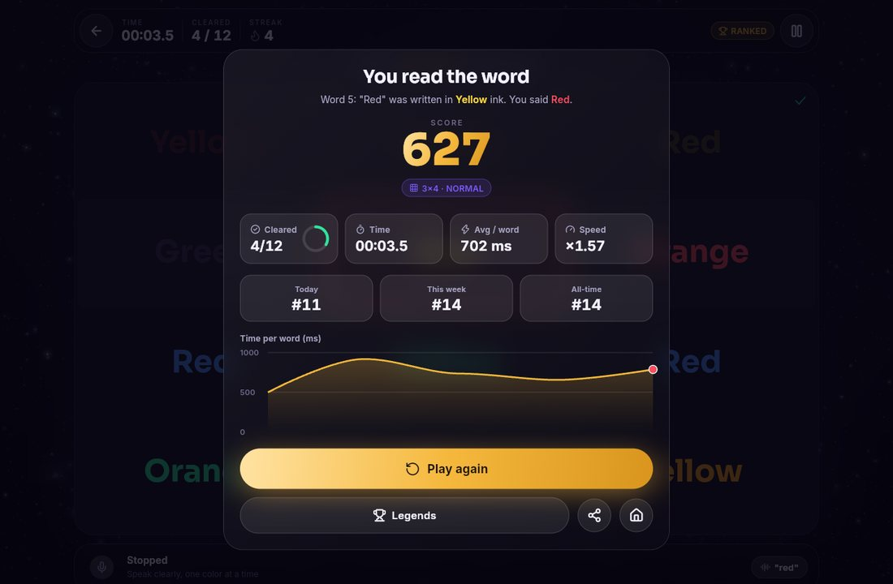<br/><sub><b>Results</b>: score, ranks and time per word</sub></td>
    <td>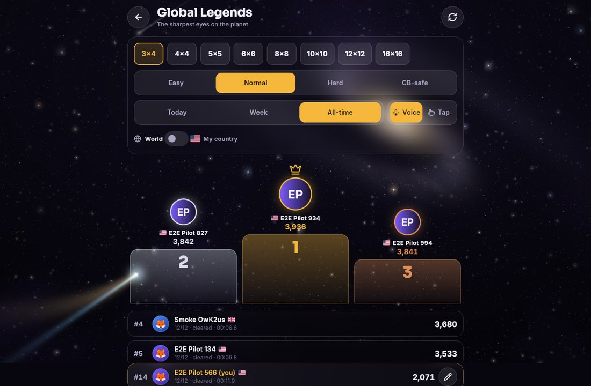<br/><sub><b>Global Legends</b>: podium and your pinned rank</sub></td>
  </tr>
  <tr>
    <td>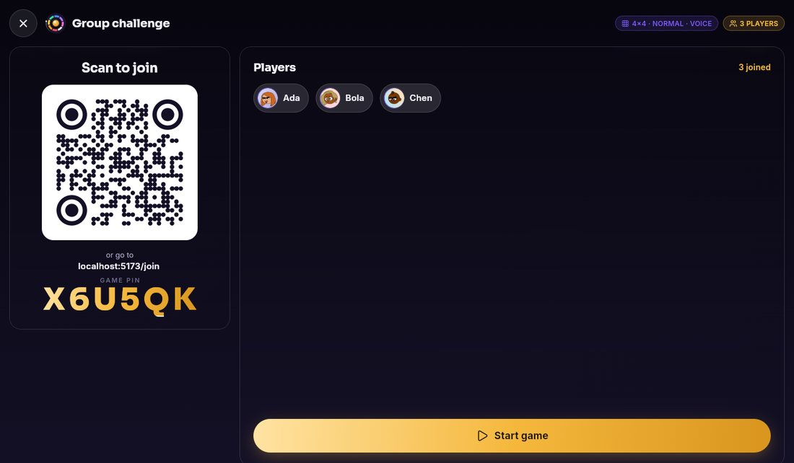<br/><sub><b>Group lobby</b>: scan the QR code or type the PIN</sub></td>
    <td>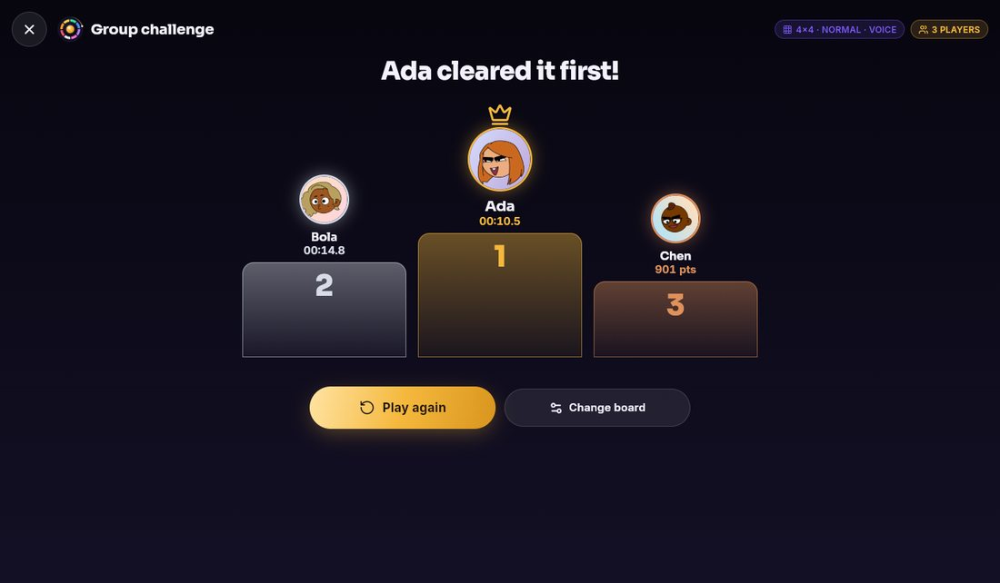<br/><sub><b>Group podium</b>: first to clear wins</sub></td>
  </tr>
  <tr>
    <td>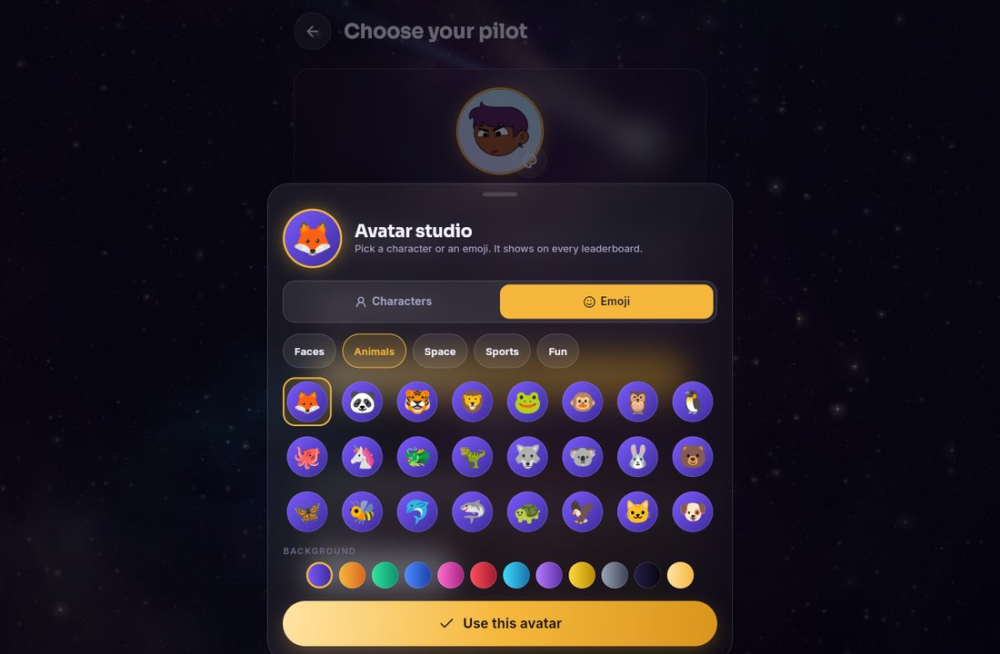<br/><sub><b>Avatar studio</b>: characters and emoji</sub></td>
    <td>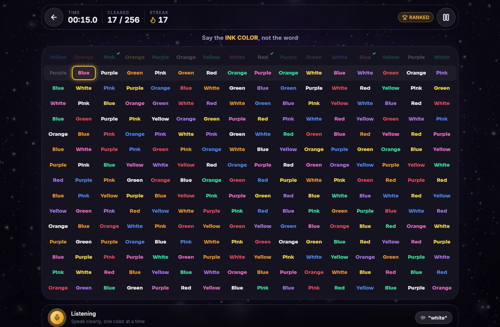<br/><sub><b>16 × 16</b>: 256 words, pixel-perfect highlight</sub></td>
  </tr>
</table>

<details>
<summary><b>🌌 The space journey</b> (click to expand)</summary>
<br/>
<table>
  <tr>
    <td width="50%">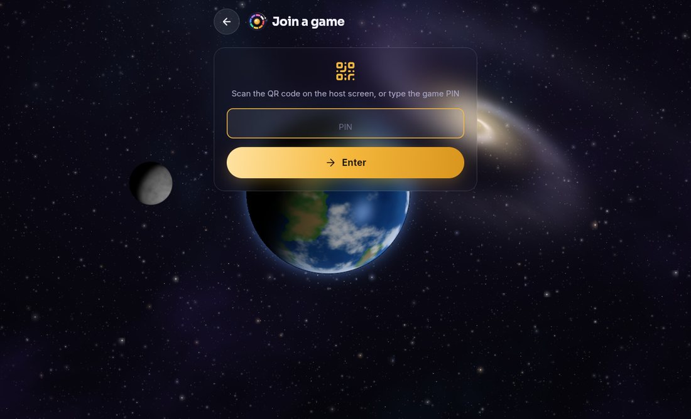<br/><sub>Earth and the Moon</sub></td>
    <td width="50%">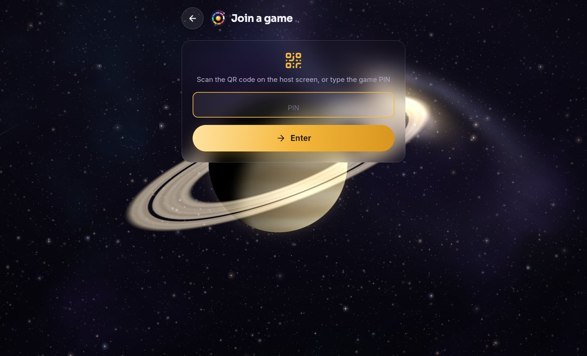<br/><sub>Saturn and its rings</sub></td>
  </tr>
  <tr>
    <td>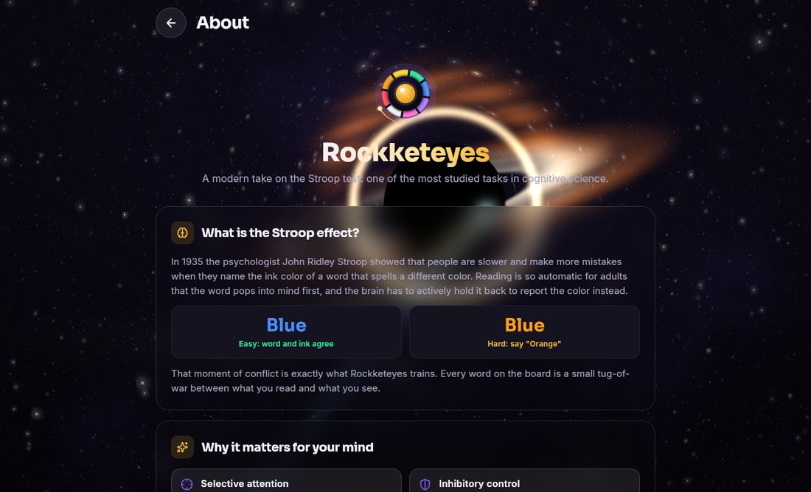<br/><sub>Black hole with accretion disk</sub></td>
    <td>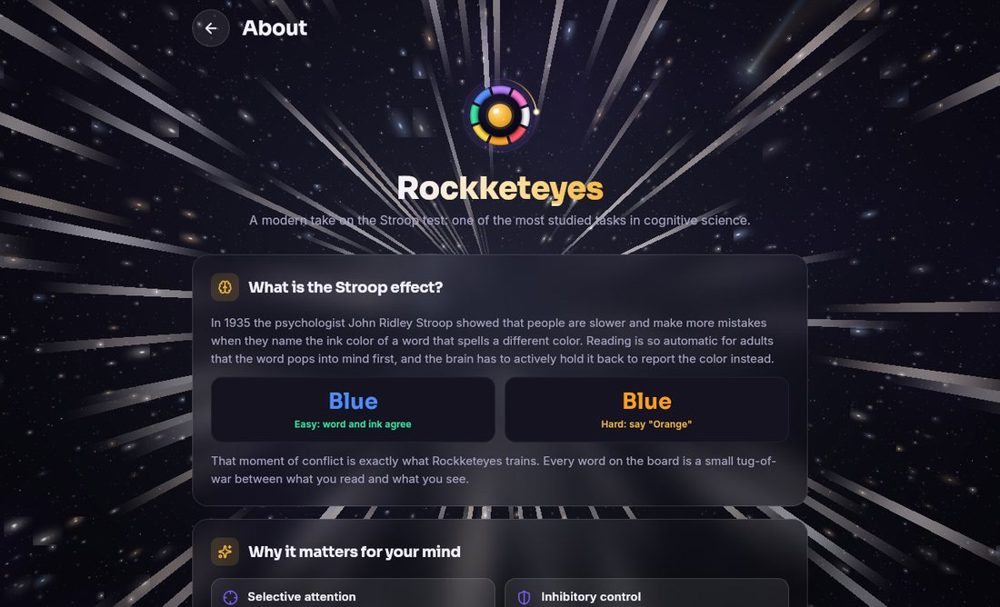<br/><sub>Hyperspace jump between places</sub></td>
  </tr>
</table>
</details>

## ✦ How a round works

1. Choose a board, difficulty and **voice** or **tap**.
2. After **3-2-1** the timer starts and the microphone opens.
3. Say each **ink color**. The highlight glides to the next word.
4. The round ends when you **clear the board** or make your **first mistake**.
5. Your score is replayed on the server and, once you connect Google, ranked on **Global Legends**.

**Scoring** rewards progress, speed and big boards:
`score = (correct × 100 × speed + streak bonus + clear bonus) × board-size multiplier`,
where *speed* compares your time with a par of 1.1 s per word.

## ✦ Group challenge

| Host (laptop, TV or phone) | Players (any phone) |
|---|---|
| **Group challenge → Open room.** A QR code and 6-letter PIN appear | Scan the QR code, or go to **/join** and type the PIN |
| Watch players join live, then press **Start** | Pick a name and avatar, then play the same board |
| See the **live race** and the **podium** | See your placing: *You won!* or *You placed #3* |

The first player to clear the board wins. If nobody clears it, the highest score wins.

## ✦ Tech stack

| Layer | Technology |
|---|---|
| App | Flutter 3.47 (Dart 3.13), Riverpod 3, go_router, custom design system |
| Graphics | GLSL fragment shader (space journey), CustomPainter board and logo |
| Voice | Web Speech API bridge (Chrome, Edge, Safari) · Android SpeechRecognizer |
| Identity | Firebase Auth: anonymous first, then Google (native picker on Android) |
| Data | Cloud Firestore: leaderboards, profiles, realtime group rooms |
| Server | Cloud Functions (TypeScript): seeds, replay validation, anti-cheat |
| Hosting | Firebase Hosting with fingerprinted, cache-safe releases |

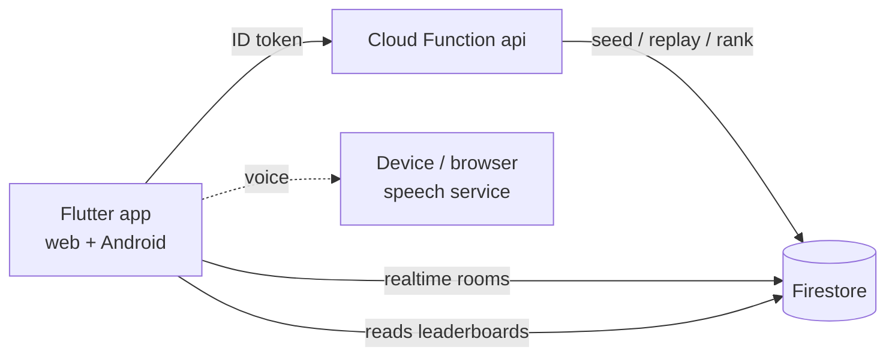

Boards come from a seeded **mulberry32** generator that is bit-identical in Dart and TypeScript. The server rebuilds each board from its seed and replays every answer before a score counts, and golden fixtures keep both sides in sync.

## ✦ Getting started

```bash
flutter pub get
(cd functions && npm install && npm run build)

# terminal 1: local backend
firebase emulators:start --only auth,firestore,functions --project rockketeyes

# terminal 2: the app (debug builds use the emulators)
flutter run -d chrome
```

Debug builds include a **voice simulator** strip for testing without speaking (Settings → Developer).

## ✦ Testing

```bash
flutter analyze && flutter test          # domain, scoring, golden fixtures, speech matcher
(cd functions && npm test)               # server core, golden parity, validator, security rules
(cd functions && npm run smoke)          # full API flow on the emulators

# End-to-end with Playwright (solo suite + host with three phones)
flutter build web --release --dart-define=RE_EMULATOR=true --dart-define=RE_E2E=true
node e2e/serve.mjs & node e2e/run.mjs out && node e2e/group.mjs out-group
```

## ✦ Deploy

```bash
# Web: fingerprinted build + Firebase Hosting
node tool/web_release.mjs --deploy

# Backend: rules, indexes, functions
firebase deploy --only firestore,functions --project rockketeyes
```

## ✦ Android

- Application ID: `com.rockketeyes.app`
- Build a release bundle: `flutter build appbundle --release --obfuscate --split-debug-info=build/symbols`
- Signing: create `android/key.properties` (git-ignored) that points at your upload keystore
- Add the Play App Signing SHA-1 to the Firebase Android app so Google sign-in works

## ✦ Project layout

```
lib/
  core/          theme, router, avatar studio, glass widgets, logo, space backdrop
  features/      game · group · legends · profile · onboarding · settings · about · legal
  services/      audio, local store, settings, profile and auth, API client
functions/       Cloud Functions: round start, score submit, profile, legends claim
firebase/        Firestore security rules and indexes
shaders/         nebula.frag: the space journey
tool/            brand generator, golden fixtures, web release
e2e/             Playwright suites
```

## ✦ Credits

Developed by **[Thalamuxtech](https://thalamux-tech.web.app)**.

- **Fonts:** Sora and Inter (SIL OFL 1.1).
- **Music and sound effects:** CC0.
- **Avatars:** DiceBear.
- **Flags:** flagcdn.com.

The full list is in [ASSET_LICENSES.md](ASSET_LICENSES.md).

## ✦ Legal

© 2026 Thalamuxtech. All rights reserved. Use of the app is governed by the in-app **Terms of Use** and **License Policy**. See also the [Privacy Policy](https://rockketeyes.web.app/privacy.html).

<div align="center">
<br/>
<sub>Built with Flutter and Firebase · <a href="https://rockketeyes.web.app">rockketeyes.web.app</a></sub>
</div>
